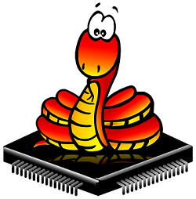
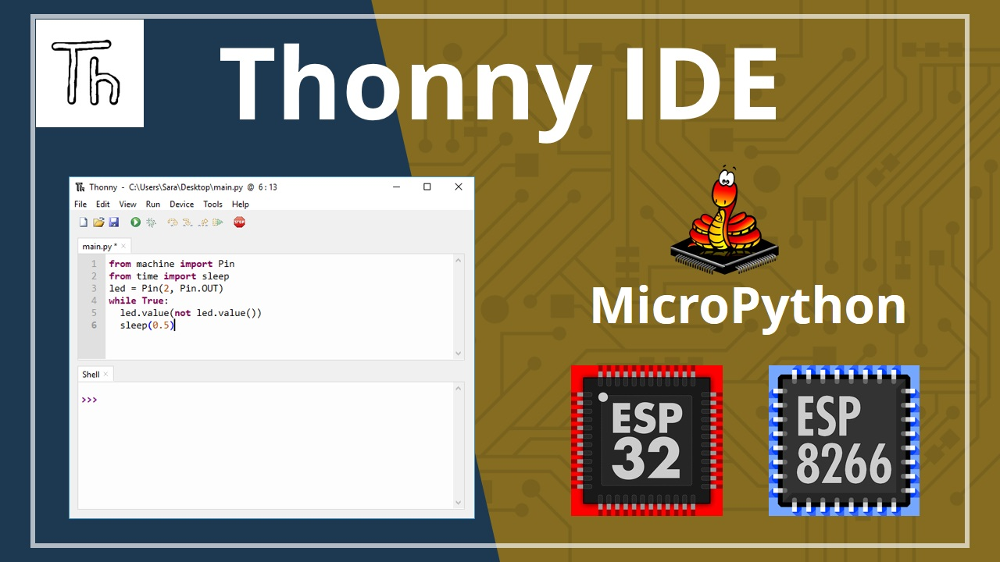

## MicroPython nedir? 

MicroPython, mikrodenetleyiciler ve gömülü sistemler için hedeflenen Python 3'ün yeniden uygulanmasıdır. MicroPython normal Python ile çok benzerdir. Yani, Python'da nasıl programlanacağını zaten biliyorsanız, MicroPython'da nasıl programlanacağını da bilirsiniz.


Birkaç istisna dışında Python'un dil özellikleri MicroPython'da da mevcuttur. Python ve MicroPython arasındaki en büyük fark, MicroPython'un kısıtlı koşullar altında çalışmak üzere tasarlanmış olmasıdır.

Bu nedenle, MicroPython tam standart kütüphane ile birlikte gelmez. Sadece Python standart kütüphanesinin küçük bir alt kümesini içerir. Bununla birlikte, düşük seviyeli donanıma erişmek için modüller içerir - bu, GPIO'lara kolayca erişmek ve bunlarla etkileşimde bulunmak için kütüphaneler olduğu anlamına gelir. 

Ek olarak, ESP8266 ve ESP32 gibi Wi-Fi özelliklerine sahip cihazlar, ağ bağlantılarını desteklemek için modüller içerir.

# Neden MicroPython? 

Python en yaygın kullanılan, basit ve öğrenmesi kolay programlama dillerinden biridir. Dolayısıyla, MicroPython'un ortaya çıkışı dijital elektroniği programlamayı son derece kolay ve basit hale getiriyor. Daha önce hiç dijital elektronik programlamadıysanız, MicroPython iyi bir başlangıç noktasıdır. 

MicroPython'un amacı, dijital elektronik programlamayı olabildiğince basit hale getirmektir, böylece herkes tarafından kullanılabilir. Şu anda MicroPython hobiciler, araştırmacılar, öğretmenler, eğitimciler tarafından ve hatta ticari ürünlerde kullanılmaktadır. ESP32 veya ESP8266 üzerinde bir LED'i yanıp söndürme kodu aşağıdaki kadar basittir:

C dili ile led yakma kodu:

```
#define LED_PIN 9  // LED'in bağlı olduğu PIN'i tanımla

// setup fonksiyonu Reset veya Güç düğmesine basıldığında bir kez çalışır
void setup() {
  // Çıktı olarak PIN 9'u başlatır
  pinMode(LED_PIN, OUTPUT);
}

// loop fonksiyonu sonsuz döngü oluşturur
void loop() {
  digitalWrite(LED_PIN, HIGH);  // LED'i yakar (HIGH gerilim(voltaj) düzeyi
  delay(500);                   // 500 milisaniye bekler
  digitalWrite(LED_PIN, LOW);   // gerilimi LOW yaparak LED'i söndürür
  delay(500);                   // 500 milisaniye bekler
}

```
MicroPython ile LED yakma kodu:

```
from machine import Pin # Pin fonksiyonu alınır
from time import sleep # uyu (bekle) fonksiyonu alınır

led = Pin('D2', Pin.OUT) #LED'in bağlı olduğu pin bir değişkene atanır

while True: #Sonsuz döngü oluşturur
    led.value(1)  # LED'i yakar
    sleep(0.5)      # 500 milisaniye bekler
    led.value(0)  # LED'i söndürür
    sleep(0.5)      # 500 milisaniye bekler

```
MicroPython'un harika bir özelliği, etkileşimli bir REPL (Oku-Değerlendir-Yazdır Döngüsü) ile birlikte gelmesidir. REPL, bir karta bağlanmanıza ve kodu derlemenize veya yüklemenize gerek kalmadan kodu hızlı bir şekilde çalıştırmanıza olanak tanır.

# Thonny MicroPython (Python) IDE

Bu rehberde size Thonny IDE'yi tanıtacağız. Bu kılavuzu tamamladıktan sonra, MicroPython ve Thonny IDE kullanarak ilk LED yanıp sönen cihazınıza sahip olacaksınız.

ESP32 ve ESP8266 kartlarını MicroPython kullanarak programlamak için çeşitli IDE'leri denedik ve Thonny iyi bir seçim gibi görünüyordu. Bazı hatalar olmasına rağmen, sürekli güncellenmekte ve geliştirilmektedir. ESP32 ve ESP8266 kartlarınızı MicroPython ile programlamanıza olanak tanır ve Windows, Mac OS X ve Linux ile uyumludur. Hatta Raspberry Pi işletim sisteminde varsayılan olarak yüklü gelir. Ek olarak, kurulumu kolaydır, bu nedenle kurulum sürecinde sorun yaşamazsınız.

